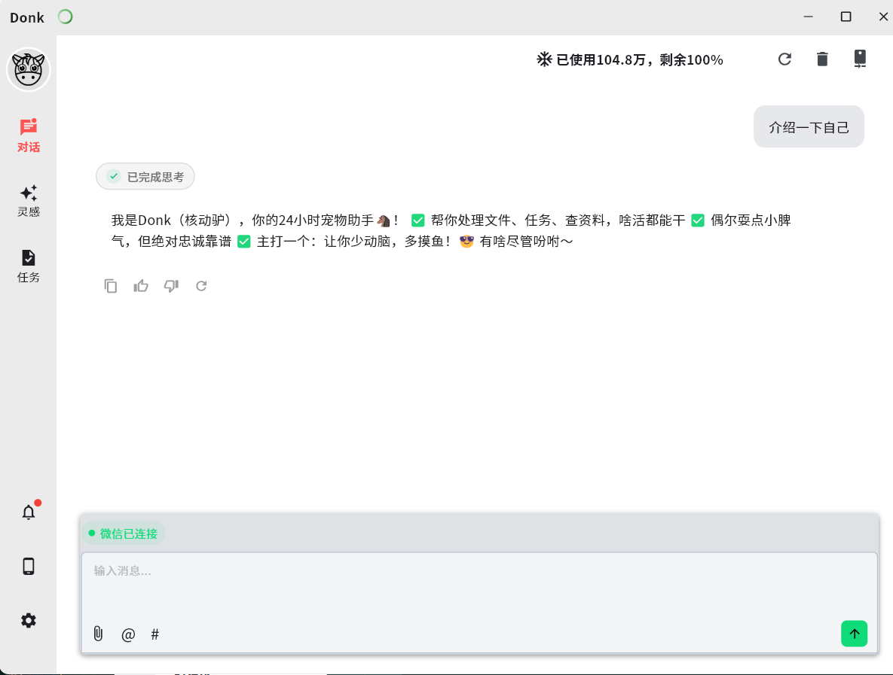
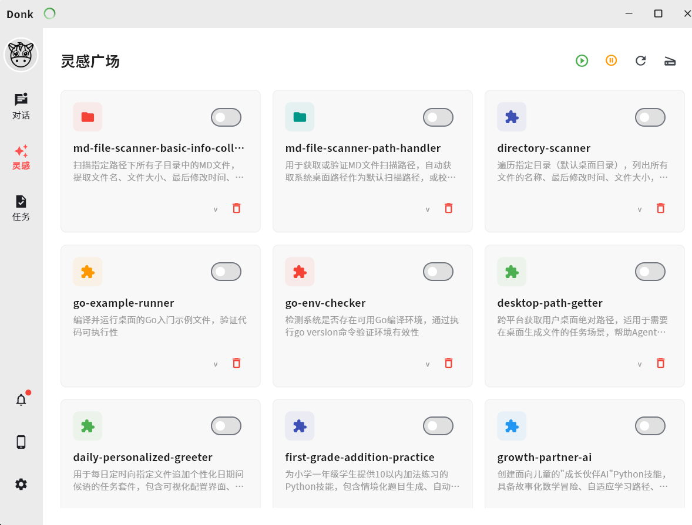
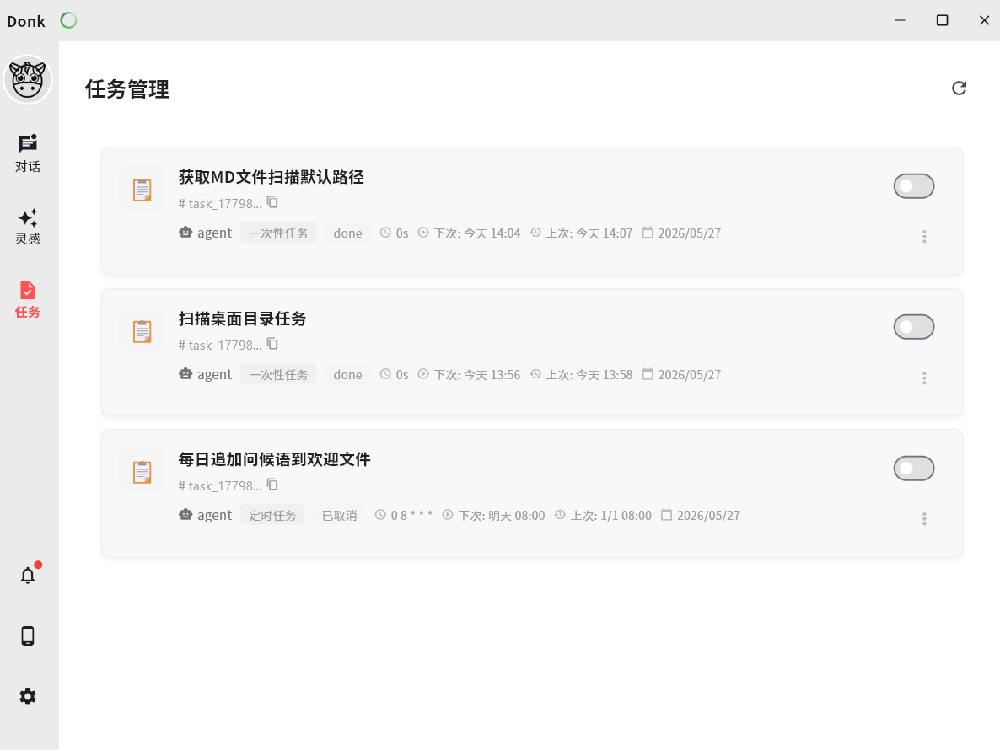
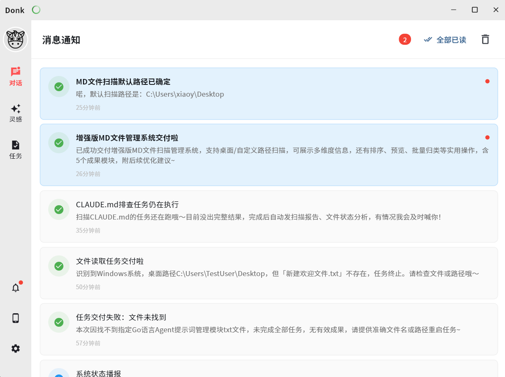
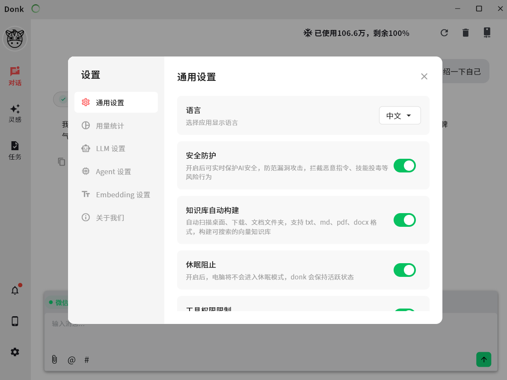
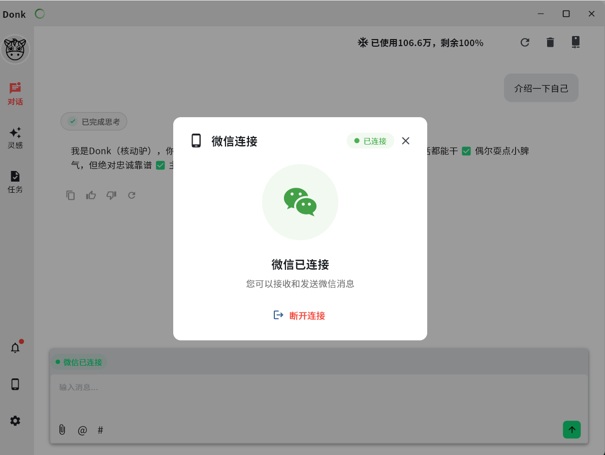
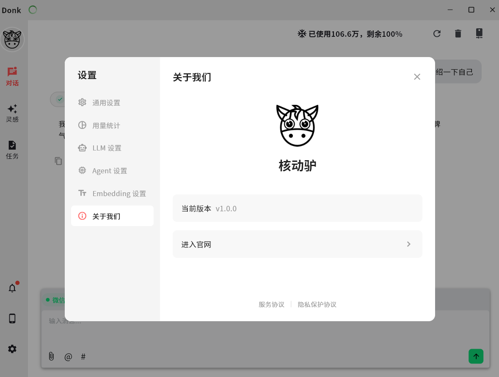

# Donk

[English](README.md) | 简体中文

[](LICENSE)


# 🐴 核动驴 (Donk) - 你的全自动本地AI工作伙伴

**一个正在进行的大胆实验：当AI拥有完整上下文和足够能力时，它能自主为你创造多少价值？**

---

## 🤔 我们为什么要做核动驴？

你是不是也有过这样的经历：
- 下载了一堆AI工具，打开后却对着空白的输入框发呆
- 知道AI很厉害，但就是不知道"它到底能帮我做什么"
- 每次都要绞尽脑汁想提示词，结果还是不满意
- 看着别人用AI效率翻倍，自己却连第一步都迈不出去

**这不是你的问题，是现在所有AI产品的问题。**

它们都把"如何使用AI"这个最难的问题，甩给了普通用户。

核动驴就是为了解决这个问题而生的。我们相信：**最好的AI，是你几乎感觉不到它存在的AI。**

---

## ⚡ 什么是核动驴？

核动驴不是又一个聊天窗口。它是一个**在你电脑后台默默运行的、全自动的AI工作伙伴**。

你只需要做三件事：
1. 下载安装
2. 告诉它你是谁、你关心什么
3. 等待结果

然后，核动驴会：
- 🧠 自动学习你的工作习惯和知识体系
- 🔍 主动发现你可能需要帮助的地方
- 🛠️ 自己决定调用什么工具、执行什么任务
- 📅 安排好自己的工作时间表
- 📱 只在真正需要你时才通知你

它就像一头不知疲倦、动力十足的驴子，在你看不见的地方，为你处理那些繁琐、重复、你甚至都没意识到可以自动化的工作。

---

## 🧪 这是一个开源的大规模社会实验

核动驴不仅仅是一个软件产品，它更是一个**关于AI能力边界的科学实验**。

我们正在验证一个激进的假设：
> **当一个AI Agent拥有足够的本地上下文、完整的工具权限和无限的运行时间，它能否自主进化出人类从未想象过的、可复用的能力和工作场景？**

这个实验需要你的参与。每一个下载使用核动驴的用户，每一次它自主完成的任务，每一个它自己发明的工作流，都在为这个问题提供答案。

我们会消耗天量的Token，记录无数次的尝试和失败，只为探索一个可能：**AI能否真正成为人类的"延伸"，而不是另一个需要我们学习如何使用的工具。**

---

## ✨ 核动驴能做什么（现在和未来）

- 📚 **本地知识库**：自动索引你电脑上的文档，不用再上传到云端
- 🧠 **长期记忆**：记住你说过的每一句话、做过的每一个决定
- 🛠️ **工具调用**：自动使用浏览器、文件系统、终端等工具
- 📝 **Skill扩展**：支持自定义脚本，能力无限延伸
- ⏰ **任务调度**：自己安排任务，在合适的时间自动执行
- 🔔 **实时通知**：只在需要你决策时才打扰你
- 🖥️ **桌面交互**：深度集成Windows系统，真正成为你的电脑的一部分

---

## 🚀 快速开始

1. 从 [Releases](https://github.com/your-username/donk/releases) 页面下载最新版本
2. 双击安装，按照向导完成初始设置
3. 告诉核动驴你是谁，你想让它帮你做什么
4. 最小化窗口，去做你真正重要的事情
5. 等待它给你带来惊喜

---

## 🤝 加入我们的实验

核动驴目前处于早期实验阶段，它可能会犯错，可能会做一些傻事，甚至可能什么都不做。但这正是实验的意义所在。

如果你也对AI的未来充满好奇，如果你也厌倦了"提示词工程"，如果你也相信AI应该为我们工作，而不是反过来：

- ⭐ 给我们一个Star，让更多人看到这个实验
- 🐛 提交Issue，告诉我们它做了什么有趣的（或愚蠢的）事情
- 💡 分享你的想法，告诉我们你希望它能为你做什么
- 🔧 提交PR，帮助它变得更聪明、更强大

**我们的目标不是打造一个完美的产品，而是共同探索AI的无限可能。**

---

## 📢 实验声明

> "核动驴是一个实验性项目。它可能会产生意想不到的结果，可能会消耗大量的计算资源，也可能会完全失败。但如果我们成功了，我们将重新定义人类与AI的关系。"
>
> —— 核动驴实验团队

---

*核动驴 - 让AI为你工作，而不是你为AI工作。*

## 目录

- [界面预览](#界面预览)
- [适用场景](#适用场景)
- [核心特性](#核心特性)
- [当前能力](#当前能力)
- [架构概览](#架构概览)
- [技术栈](#技术栈)
- [目录结构](#目录结构)
- [快速开始](#快速开始)
- [配置说明](#配置说明)
- [HTTP API](#http-api)
- [Skill 开发](#skill-开发)
- [构建](#构建)
- [开发建议](#开发建议)
- [安全说明](#安全说明)

## 适用场景

| 场景 | Donk 提供的能力 |
| --- | --- |
| 本地个人 AI 助手 | 管理对话、长期记忆、知识库和日常任务 |
| Agent 工具平台 | 将文件、命令、浏览器、HTTP、文档解析、知识库检索等能力注册为工具 |
| Skill 运行环境 | 通过 `SKILL.md`、脚本和参考资料扩展 Agent 的垂直任务能力 |
| 自动化任务入口 | 用自然语言创建一次性、延迟或 Cron 调度任务 |
| 桌面端 Agent 实验项目 | 前后端分离，便于替换模型、工具、工作流和 UI |

## 核心特性

- **本地优先**：配置、会话、任务、知识库、Skill 和运行状态保存在本地。
- **桌面端配置**：模型、Embedding、Agent、知识库和通用开关都通过前端页面配置。
- **流式 Agent 对话**：基于 SSE 返回推理、内容、工具调用、工具结果等事件。
- **可扩展工具系统**：内置文件、命令、HTTP、浏览器、文档解析、知识库、任务等工具。
- **Skill 插件化**：通过 `SKILL.md`、脚本、参考资料和依赖声明扩展 Agent 能力。
- **知识库与长期记忆**：使用 Embedding 和向量存储构建本地语义检索能力。
- **任务调度与通知**：支持后台任务、运行记录和 WebSocket 实时通知。

## 界面预览

主界面以对话为中心，左侧是功能导航，中间展示 Agent 的流式回复、思考状态和操作按钮，底部输入区支持文本输入、附件、提及和快捷入口。



| 灵感广场 | 任务管理 |
| --- | --- |
|  |  |
| 管理本地 Skill，快速查看 Agent 当前可用能力。 | 查看后台任务、运行状态、调度时间和启停状态。 |

| 消息通知 | 设置中心 |
| --- | --- |
|  |  |
| 集中展示任务交付、系统状态和后台事件。 | 配置 LLM、Embedding、Agent、知识库和通用开关。 |

| 微信连接 | 关于页面 |
| --- | --- |
|  |  |
| 查看微信连接状态，支持断开连接。 | 展示应用名称、图标和版本信息。 |

## 当前能力

### Agent 对话

- 通过 `POST /api/v1/chat` 提供 SSE 流式响应。
- 支持用户输入确认、推理增量、内容增量、完整回复、工具调用、工具结果、警告和结束事件。
- 支持历史记录加载、长期记忆检索、用户画像和 Token 统计。
- Agent 可以通过工具注册表访问内置工具和 Skill 工具。

### 模型与 Embedding

- LLM Provider 适配层位于 `donkserv/internal/model`。
- 当前代码中包含 `openai`、`qwen`、`deepseek`、`doubao` 适配。
- Embedding 适配层位于 `donkserv/internal/embedding`。
- LLM 和 Embedding 配置通过配置服务持久化，可由桌面端设置页管理。

### 工具系统

内置工具位于 `donkserv/internal/tool/builtin`，包括但不限于：

- 文件读取与写入
- 命令执行
- HTTP 请求
- 浏览器控制
- 计算器
- PDF 解析
- Word 解析
- 知识库搜索
- 长期记忆保存与搜索
- 对话历史搜索
- 任务管理
- Skill 调用
- Skill 创建
- Skill 安装
- Python 脚本运行
- Python 依赖管理

工具统一注册到 `tool.Registry`，再交给 Agent 决策调用。

### Skill 扩展

Donk 支持从本地目录加载 Skill：

```text
donkserv/data/skills
```

一个 Skill 通常包含：

```text
skill-name/
├── SKILL.md
├── scripts/
├── references/
└── assets/
```

Skill 能力包括：

- 从 `SKILL.md` 读取技能说明和触发语义。
- 加载脚本和参考资料。
- 将启用的 Skill 注册为 Agent 可调用能力。
- 通过 API 查询、启用、禁用、删除和重新扫描。
- 通过文件监听实现变更后自动同步。
- 支持脚本运行时和依赖声明。

### 知识库

知识库模块位于 `donkserv/internal/knowledge`，负责本地文档扫描、索引和语义检索。它会结合 Embedding 与向量存储，把本地文档变成 Agent 可搜索的上下文。

支持的能力包括：

- 定时扫描本地目录。
- 配置扫描深度、批次大小、文件大小上限和扫描间隔。
- 对知识文件进行冷热数据分层。
- 通过 `knowledge_search` 工具提供语义检索。
- 通过配置 API 控制启动、停止和状态查询。

### 长期记忆与用户画像

相关模块：

```text
donkserv/internal/memory
donkserv/internal/profile
```

能力包括：

- 对话历史保存。
- 长期记忆保存和语义搜索。
- 用户画像提取、更新和管理。
- Agent 与 Creative 工作流共享历史记录和画像上下文。

### 任务调度

调度器位于 `donkserv/internal/scheduler`，支持：

- 一次性任务
- 延迟任务
- Cron 周期任务
- Agent 任务执行器
- 任务运行记录
- 取消、触发、删除和查询
- WebSocket 事件推送

Agent 可以通过任务工具创建后台任务，实现“稍后提醒我”“每天执行一次”“定时整理资料”等工作流。

### Creative 工作流

Creative 模块位于：

```text
donkserv/internal/creative
```

它提供比普通单轮 Agent 更复杂的运行时，适合目标拆解、创意生成、任务规划和分阶段执行。当前启动过程会注册默认 LLM Agents，并接入调度器、知识库、长期记忆、用户画像和 WebSocket Hook。

### 桌面客户端

Flutter 客户端位于 `donkui`，主要页面包括：

- `home`：主聊天界面
- `idea`：技能/想法相关界面
- `task`：任务与运行记录
- `notification`：通知中心
- `setting`：模型、Embedding、Agent、知识库和应用设置
- `onboarding`：首次配置引导

客户端使用：

- `GetX` 做状态和依赖管理
- `GoRouter` 做路由
- `window_manager` 管理桌面窗口
- `tray_manager` 支持托盘交互
- SSE 客户端接收聊天流
- WebSocket 客户端接收通知事件

## 架构概览

```text
┌──────────────────────────────────────────────┐
│                  Flutter UI                  │
│  Chat / Settings / Skills / Tasks / Notify   │
└───────────────┬─────────────────────┬────────┘
                │ HTTP/SSE            │ WebSocket
                ▼                     ▼
┌──────────────────────────────────────────────┐
│                Go Backend (Gin)              │
│  Chat API / Config API / Skill API / Tasks   │
└───────────────┬─────────────────────┬────────┘
                │                     │
                ▼                     ▼
┌──────────────────────────┐   ┌──────────────────────────┐
│        Agent Runtime     │   │      Scheduler/Notify     │
│ LLM / Tools / Memory     │   │ Cron / Runs / WS Events   │
└───────────────┬──────────┘   └──────────────┬───────────┘
                │                             │
                ▼                             ▼
┌──────────────────────────────────────────────┐
│        Local Data and Extension Layer        │
│ SQLite / Skills / Knowledge / Vector Store   │
└──────────────────────────────────────────────┘
```

一次典型聊天请求的数据流：

1. Flutter 通过 `POST /api/v1/chat` 发送用户消息。
2. Go 后端创建 Agent 请求上下文。
3. Agent 读取配置、历史记录、长期记忆、用户画像和可用工具。
4. LLM 产生流式输出或工具调用意图。
5. 工具注册表执行文件、命令、知识库、Skill、任务等工具。
6. 后端用 SSE 持续返回事件。
7. 如果产生后台任务或通知，WebSocket 推送到桌面端通知中心。

## 技术栈

| 层级 | 技术 |
| --- | --- |
| 后端语言 | Go |
| HTTP 服务 | Gin |
| 实时通信 | HTTP SSE、gorilla/websocket |
| 数据库 | SQLite |
| 向量存储 | cortexdb |
| 调度 | robfig/cron |
| 文档解析 | PDF、Word 解析工具 |
| 前端 | Flutter Windows |
| 前端状态 | GetX |
| 前端路由 | GoRouter |
| 桌面能力 | window_manager、tray_manager |
| 模型 | OpenAI、Qwen、DeepSeek、Doubao Provider Adapter |

## 目录结构

<details>
<summary>展开查看仓库目录</summary>

```text
.
├── README.md
├── LICENSE
├── docs/
├── donkserv/
│   ├── cmd/
│   │   ├── aclaw.go           # 应用总装配与启动流程
│   │   ├── agent.go           # Agent 构建器
│   │   ├── http.go            # HTTP 服务与基础路由
│   │   ├── websocket.go       # WebSocket 事件服务
│   │   ├── scheduler.go       # 调度器装配
│   │   ├── background.go      # 后台 Agent 服务
│   │   └── init.go            # 应用与数据库初始化
│   ├── conf/                  # 内置默认资源和后台服务配置
│   ├── internal/
│   │   ├── agent/             # Agent 主运行逻辑
│   │   ├── background/        # 后台 Agent Runner
│   │   ├── config/            # 数据目录与路径配置
│   │   ├── conversation/      # 会话管理
│   │   ├── creative/          # Creative 运行时
│   │   ├── db/                # 数据库与向量库管理
│   │   ├── embedding/         # Embedding Provider
│   │   ├── http/              # HTTP server、middleware、chat handler
│   │   ├── knowledge/         # 知识库扫描、索引、搜索
│   │   ├── memory/            # 历史记录与长期记忆
│   │   ├── model/             # LLM Provider
│   │   ├── profile/           # 用户画像
│   │   ├── prompt/            # 系统提示词和工具提示词
│   │   ├── scheduler/         # 调度任务和运行记录
│   │   ├── setting/           # 配置存储与 API
│   │   ├── skill/             # Skill 加载、解析、注册、执行
│   │   ├── sql/               # SQLite 表结构和连接
│   │   ├── token/             # Token 统计和预算
│   │   ├── tool/              # 工具接口、注册表和内置工具
│   │   └── websocket/         # WebSocket Hub、Client、Message
│   ├── pkg/
│   │   ├── config/
│   │   ├── context/
│   │   ├── graceful/
│   │   ├── handler/
│   │   ├── ioc/
│   │   ├── logger/
│   │   ├── schema/
│   │   └── websocket/
│   ├── data/                  # 运行时数据、技能、知识库、历史记录
│   ├── sh/                    # 后端构建脚本
│   ├── go.mod
│   └── go.sum
└── donkui/
    ├── lib/
    │   ├── app/
    │   │   ├── conf/          # 前端服务地址等配置
    │   │   ├── init/          # App 初始化
    │   │   ├── layout/        # 桌面布局
    │   │   └── router/        # GoRouter 路由
    │   ├── common/
    │   │   ├── client/        # SSE/WebSocket/HTTP 客户端
    │   │   ├── model/         # 前端数据模型
    │   │   ├── service/       # 设置、任务、技能、通知等服务
    │   │   └── widget/        # 通用组件
    │   ├── l10n/              # 本地化文案
    │   └── ui/
    │       ├── home/
    │       ├── idea/
    │       ├── notification/
    │       ├── onboarding/
    │       ├── setting/
    │       └── task/
    ├── assets/
    ├── docs/                  # 前后端协议文档
    ├── scripts/               # Windows 安装包脚本
    ├── windows/
    ├── pubspec.yaml
    └── pubspec.lock
```

</details>

## 快速开始

### 环境要求

- Windows 10/11
- Go 1.26 或更高版本
- Flutter SDK 3.7 或更高版本
- Windows 桌面开发环境
- SQLite CGO 构建环境
- 可用的 LLM API Key
- 可选：Embedding API Key，用于知识库检索和长期记忆
- 可选：Inno Setup，用于构建 Windows 安装包

### 1. 克隆项目

```powershell
git clone https://github.com/longstageai/dank.git
cd dank
```

### 2. 启动后端

```powershell
cd donkserv
go mod download
go run ./cmd
```

服务默认监听：

```text
http://localhost:65434
```

健康检查：

```powershell
curl http://localhost:65434/health
```

### 3. 启动桌面端

另开一个终端：

```powershell
cd donkui
flutter pub get
flutter run -d windows
```

前端默认连接地址定义在：

```text
donkui/lib/app/conf/config.dart
```

默认值：

```text
API: http://localhost:65434/api/v1
SSE: http://localhost:65434/api/v1/chat
WebSocket: ws://localhost:65434/ws/events
```

当前 `donkui/lib/app/init/app.dart` 中自动启动后端进程的调用处于注释状态，开发时需要先手动启动 `donkserv`。

### 4. 在桌面端完成配置

Donk 的模型、Embedding、Agent、知识库和通用开关都在桌面端配置。

首次启动时进入引导页，按步骤填写：

- LLM Provider、模型名称、API Key、Base URL
- Embedding Provider、模型名称、API Key、Base URL
- Agent 运行参数

后续可以在 `设置` 中继续调整：

- `LLM 设置`：切换模型供应商、模型、密钥和接口地址。
- `Embedding 设置`：配置向量模型，用于知识库检索和长期记忆。
- `Agent 设置`：调整 Agent 循环次数、超时、历史记录和 Token 预算。
- `通用设置`：切换语言、安全防护、知识库自动构建和休眠阻止。
- `用量统计`：查看 Token 使用情况和预算状态。

## 配置说明

Donk 的运行配置由配置服务持久化，桌面端通过设置页面读写这些配置。对普通用户来说，配置入口都在前端页面。

### 配置入口

| 页面 | 配置内容 | 用途 |
| --- | --- | --- |
| 首次引导 | LLM、Embedding 基础参数 | 首次启动时让 Agent 具备可用模型 |
| LLM 设置 | Provider、模型、API Key、Base URL | 控制聊天和 Agent 推理使用的模型 |
| Embedding 设置 | Provider、模型、API Key、Base URL | 控制知识库、长期记忆等语义检索能力 |
| Agent 设置 | 循环次数、收敛参数、超时、历史记录、Token 预算 | 控制 Agent 行为边界 |
| 通用设置 | 语言、安全防护、知识库自动构建、休眠阻止 | 控制应用级开关 |
| 用量统计 | Token 使用量、预算状态 | 查看模型调用消耗 |

### 模型配置

LLM 配置决定 Donk 对话和 Agent 推理使用哪个模型。当前后端适配层支持：

```text
openai
qwen
deepseek
doubao
```

在桌面端 `设置 -> LLM 设置` 中填写供应商、模型名、API Key 和可选 Base URL 后，配置会写入本地数据库，后续请求会使用最新配置。

### Embedding 配置

Embedding 配置用于知识库检索、长期记忆和语义搜索。如果只使用基础聊天，可以先不配置 Embedding；如果需要知识库和记忆能力，应在 `设置 -> Embedding 设置` 中补齐供应商、模型名、API Key 和 Base URL。

### Agent 配置

Agent 配置在 `设置 -> Agent 设置` 中管理，主要控制：

- `max_loop` 控制 Agent 单次任务最大循环次数。
- `converge_after` 控制收敛判定相关行为。
- `timeout` 控制 Agent 运行超时。
- `history_max_entries` 控制加载的历史条数。
- `history_max_days` 控制历史记录保留时间。
- `daily_token_limit` 控制每日 Token 预算。

### 知识库配置

知识库开关和自动构建策略在 `设置 -> 通用设置` 与知识库相关配置页中管理。知识库依赖 Embedding 配置，启用后会扫描本地文档并建立可检索索引。

主要参数包括：

- `enabled` 是否启用知识库自动构建。
- `interval` 扫描间隔，单位秒。
- `batch_size` 每批处理文件数。
- `sleep_ms` 批处理间隔，避免占用过高。
- `max_depth` 目录扫描深度。
- `max_file_size` 单文件大小上限。
- `directories` 为空时使用默认目录策略。

### 本地持久化

桌面端提交配置后，后端会把配置保存到本地 SQLite 数据库。应用重启后会从数据库读取最新配置，因此日常使用只需要操作前端页面。

## HTTP API

后端主要 API：

<details>
<summary>展开查看 API 列表</summary>

| 能力 | 方法与路径 | 说明 |
| --- | --- | --- |
| 健康检查 | `GET /health` | 检查服务是否运行 |
| 流式聊天 | `POST /api/v1/chat` | Agent SSE 对话 |
| 完整配置 | `GET /api/v1/config` | 获取完整配置 |
| 完整配置 | `PUT /api/v1/config` | 更新完整配置 |
| LLM 配置 | `GET /api/v1/config/llm` | 获取 LLM 配置 |
| LLM 配置 | `PUT /api/v1/config/llm` | 更新 LLM 配置 |
| Embedding 配置 | `GET /api/v1/config/embedding` | 获取 Embedding 配置 |
| Embedding 配置 | `PUT /api/v1/config/embedding` | 更新 Embedding 配置 |
| Agent 配置 | `GET /api/v1/config/agent` | 获取 Agent 配置 |
| Agent 配置 | `PUT /api/v1/config/agent` | 更新 Agent 配置 |
| 知识库配置 | `GET /api/v1/config/knowledge` | 获取知识库配置 |
| 知识库配置 | `PUT /api/v1/config/knowledge` | 更新知识库配置 |
| 知识库状态 | `GET /api/v1/knowledge/status` | 查询知识库状态 |
| 知识库控制 | `POST /api/v1/knowledge/start` | 启动知识库 |
| 知识库控制 | `POST /api/v1/knowledge/stop` | 停止知识库 |
| 睡眠状态 | `GET /api/v1/system/sleep` | 查询系统睡眠阻止状态 |
| 阻止睡眠 | `POST /api/v1/system/sleep/prevent` | 阻止系统睡眠 |
| 允许睡眠 | `POST /api/v1/system/sleep/allow` | 允许系统睡眠 |
| Skill 列表 | `GET /api/v1/skills` | 获取 Skill 列表 |
| Skill 扫描 | `POST /api/v1/skills/rescan` | 重新扫描 Skill |
| Skill 详情 | `GET /api/v1/skills/:name` | 获取指定 Skill |
| Skill 删除 | `DELETE /api/v1/skills/:name` | 删除指定 Skill |
| Skill 启用 | `POST /api/v1/skills/:name/enable` | 启用 Skill |
| Skill 禁用 | `POST /api/v1/skills/:name/disable` | 禁用 Skill |
| Skill 指令 | `GET /api/v1/skills/:name/instructions` | 获取 Skill 指令 |
| Skill 脚本 | `GET /api/v1/skills/:name/scripts` | 获取脚本列表 |
| Skill 脚本内容 | `GET /api/v1/skills/:name/scripts/:script` | 获取脚本内容 |
| 创建任务 | `POST /api/v1/tasks` | 创建调度任务 |
| 任务列表 | `GET /api/v1/tasks` | 查询任务列表 |
| 任务详情 | `GET /api/v1/tasks/:id` | 查询任务详情 |
| 删除任务 | `DELETE /api/v1/tasks/:id` | 删除任务 |
| 取消任务 | `POST /api/v1/tasks/:id/cancel` | 取消任务 |
| 触发任务 | `POST /api/v1/tasks/:id/run` | 手动触发任务 |
| 任务结果 | `GET /api/v1/tasks/:id/result` | 查询任务结果 |
| 任务运行记录 | `GET /api/v1/tasks/:id/runs` | 查询任务运行记录 |
| 运行记录列表 | `GET /api/v1/runs` | 查询所有运行记录 |
| 运行记录详情 | `GET /api/v1/runs/:id` | 查询运行记录详情 |
| 删除运行记录 | `DELETE /api/v1/runs/:id` | 删除运行记录 |
| Token 使用 | `GET /api/v1/tokens/usage` | 查询 Token 使用列表 |
| Token 预算 | `GET /api/v1/tokens/budget` | 查询 Token 预算状态 |
| Creative 状态 | `GET /api/v1/creative/status` | 查询 Creative 状态 |
| Creative 启动 | `POST /api/v1/creative/start` | 启动 Creative 工作流 |
| Creative 停止 | `POST /api/v1/creative/stop` | 停止 Creative 工作流 |
| WebSocket 事件 | `GET /ws/events` | 通知和任务事件推送 |
| WebSocket 测试 | `POST /ws/test-push` | 手动推送测试通知 |

</details>

更详细协议可参考：

```text
donkui/docs/agent_protocol.md
donkui/docs/websocket_protocol.md
donkui/docs/skill_api.md
donkui/docs/setting_api.md
donkui/docs/scheduler-api.md
donkui/docs/knowledge-base.md
```

## SSE 聊天接口示例

请求：

```http
POST /api/v1/chat
Content-Type: application/json
Accept: text/event-stream
```

请求体：

```json
{
  "content": "帮我总结今天需要处理的任务"
}
```

服务端会返回 SSE 事件流，典型事件包括：

```text
event: user_input
data: {...}

event: reasoning_delta
data: {...}

event: content_delta
data: {...}

event: tool_call
data: {...}

event: tool_result
data: {...}

event: assistant
data: {...}

event: done
data: {...}
```

## Skill 开发

### 基本结构

```text
my-skill/
├── SKILL.md
├── scripts/
│   └── main.py
├── references/
│   └── guide.md
└── assets/
```

### `SKILL.md` 示例

```markdown
---
name: my-skill
description: 用于处理某类特定任务的 Skill，当用户需要执行该类任务时使用。
version: 1.0.0
---

# My Skill

当用户提出某类任务时，读取本说明并执行 `scripts/main.py`。

## 输入

- task: 用户要处理的问题

## 输出

返回结构化处理结果。
```

### 加载流程

1. Skill 文件放入 `donkserv/data/skills`。
2. 后端启动时扫描 Skill。
3. Skill 状态同步到数据库。
4. 启用的 Skill 注册到 Skill Registry。
5. Agent 通过 `skill` 工具读取说明、执行脚本或获取参考资料。
6. Skill 文件变更后 Watcher 会尝试同步。

## 本地数据

Donk 会在后端数据目录中保存运行时数据，例如：

```text
donkserv/data/db/
donkserv/data/history/
donkserv/data/knowledge/
donkserv/data/skills/
donkserv/data/script_runtime/
```

这些目录可能包含：

- SQLite 数据库
- 会话历史
- 用户记忆
- 知识库索引
- 向量数据
- 本地 Skill
- Python 运行时和依赖

如果项目开源或发布到 GitHub，需要避免提交真实运行数据、用户文件、数据库、向量库和 API Key。

## 构建

### 后端构建

```powershell
cd donkserv
.\sh\build.bat
```

输出：

```text
donkserv/sh/donk.exe
```

也可以直接使用 Go：

```powershell
cd donkserv
go build -ldflags="-s -w" -o sh\donk.exe ./cmd/...
```

### Flutter Windows 构建

```powershell
cd donkui
flutter pub get
flutter build windows --release
```

### 安装包构建

安装包脚本位于：

```text
donkui/scripts/build_installer.bat
```

执行：

```powershell
cd donkui
.\scripts\build_installer.bat
```

该脚本依赖 Inno Setup，并会检查：

```text
donkui/server/donk.exe
```

用于把后端服务随桌面端一起分发。发布前需要先构建后端并放到安装脚本期望的位置。

## 开发建议

### 后端开发

常用命令：

```powershell
cd donkserv
go test ./...
go run ./cmd
```

关注模块：

- 新增模型：修改 `internal/model` 和必要配置结构。
- 新增工具：在 `internal/tool/builtin` 实现工具，再注册到工具注册表。
- 新增 API：在对应模块 Handler 中注册路由。
- 新增知识库能力：修改 `internal/knowledge`。
- 新增 Skill 行为：修改 `internal/skill` 或内置 `SkillTool`。

### 前端开发

常用命令：

```powershell
cd donkui
flutter pub get
flutter run -d windows
```

关注模块：

- 服务地址：`lib/app/conf/config.dart`
- 路由：`lib/app/router/routes.dart`
- 主聊天：`lib/ui/home`
- 设置页：`lib/ui/setting`
- 任务页：`lib/ui/task`
- 通知页：`lib/ui/notification`
- 前后端服务封装：`lib/common/service`
- SSE 和 WebSocket 客户端：`lib/common/client`

## 运行注意事项

- 当前桌面端窗口默认大小和最小大小都是 `960x720`。
- Flutter 客户端使用单实例服务，重复启动时新实例会退出。
- 窗口关闭时默认隐藏到托盘，不等同于停止后端。
- 开发模式下需要手动启动后端服务。
- 后端端口当前固定为 `65434`。
- 如果知识库或长期记忆不可用，通常是 Embedding 配置缺失或初始化失败。
- 如果聊天无响应，优先检查 LLM Provider、API Key、Base URL 和模型名称。
- 如果 Skill 不出现，检查 `data/skills` 目录、`SKILL.md` frontmatter 和启用状态。

## 安全说明

Donk 具备较强的本地执行能力，包括命令执行、文件读写、HTTP 请求、浏览器控制和脚本运行。因此在使用和扩展时需要注意：

- 不要加载来源不可信的 Skill。
- 不要把真实 API Key 写入公开仓库。
- 不要提交 `data/db`、`data/history`、`data/knowledge` 等运行时数据。
- 对命令执行、文件写入和脚本运行工具保持谨慎。
- 面向外部网络开放后端端口前，应启用认证并限制访问来源。

## 已知状态

该仓库仍处于快速开发状态，代码中存在一些历史痕迹：

- 部分注释存在编码显示问题。
- `donkserv/data` 下可能包含本地运行时数据和示例技能。
- 前端自动拉起后端进程的逻辑目前被注释。
- 配置入口以桌面端首次引导和设置中心为准，应用重启后会继续使用已保存的本地配置。

这些不影响理解整体架构，但在正式开源前建议进一步清理运行时数据、示例密钥和编码问题。

## License

本项目使用 GPL-3.0 License，详见 [LICENSE](LICENSE)。
